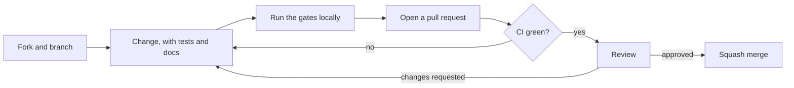

# Contributing to pn-ultramemory

Thank you for wanting to help. This project is small on purpose, and it only stays small,
fast and trustworthy if changes are made carefully. This guide explains how to do that without
friction.

**Contents**

1. [Ways to contribute](#ways-to-contribute)
2. [Ground rules](#ground-rules)
3. [Set up your machine](#set-up-your-machine)
4. [The gates every change must pass](#the-gates-every-change-must-pass)
5. [Code standards](#code-standards)
6. [Commits and pull requests](#commits-and-pull-requests)
7. [Tests](#tests)
8. [Adding a language pack](#adding-a-language-pack)
9. [Versions and releases](#versions-and-releases)
10. [Getting help](#getting-help)

## Ways to contribute

| You want to... | Do this |
|---|---|
| Report a bug | Open an [issue](https://github.com/paulnewmandev/pn-ultramemory/issues/new/choose) with the bug form. |
| Report a security problem | **Do not open an issue.** Follow [SECURITY.md](SECURITY.md). |
| Propose a feature | Open a feature request first, so the design can be agreed before you write code. |
| Fix a bug or add a small improvement | Send a pull request directly. |
| Improve the documentation | Send a pull request. Documentation fixes are always welcome. |
| Add support for a language | See [Adding a language pack](#adding-a-language-pack). |
| Add a benchmark task or a real-world example | Open an issue to agree on the format, then send a pull request. |
| Ask a question | Use [Discussions](https://github.com/paulnewmandev/pn-ultramemory/discussions). |

## Ground rules

- **Be kind.** Everyone taking part must follow the [Code of Conduct](CODE_OF_CONDUCT.md).
- **Coding assistants** are allowed, under one condition: a human is accountable for the change.
  See [AI_POLICY.md](AI_POLICY.md). In short: you are the author, no machine co-author trailers,
  and the gates below apply to everyone equally.
- **Licensing.** The project is licensed under [Apache-2.0](LICENSE). By contributing you agree that
  your contribution is licensed under the same terms (inbound equals outbound). You keep your
  copyright. There is no contributor license agreement.
- **Sign off your commits** with the [Developer Certificate of Origin](https://developercertificate.org/).
  It is a statement that you wrote the change, or have the right to submit it under the project
  license. Add it with `git commit -s`, which appends a line like
  `Signed-off-by: Your Name <you@example.com>` using your real name.
- **Discuss big changes first.** Anything that touches the public API, the storage format or the
  architecture should start as an issue or a discussion. Architecture decisions are recorded as
  short documents in [docs/adr](docs/adr).
- **Keep the promise of the project.** No telemetry, no network calls by default, no data leaving the
  machine, and every stored claim carries its provenance. See
  [ADR-0004](docs/adr/0004-local-only-no-telemetry.md).

## Set up your machine

You need [rustup](https://rustup.rs). The exact compiler is pinned in
[`rust-toolchain.toml`](rust-toolchain.toml), and rustup installs it automatically the first time
you run a `cargo` command inside the repository.

```sh
git clone https://github.com/paulnewmandev/pn-ultramemory.git
cd pn-ultramemory
cargo build --workspace
cargo test --workspace
```

Optional but recommended tools:

| Tool | Install | Used for |
|---|---|---|
| `cargo-deny` | `cargo install cargo-deny --locked` | License, advisory and source policy (`cargo deny check`) |

## The gates every change must pass

CI runs the same commands on Linux, macOS and Windows. Run them locally before you push.

| Gate | Command | What it enforces |
|---|---|---|
| Format | `cargo fmt --all -- --check` | One code style, no debate. |
| Lint | `cargo clippy --workspace --all-targets -- -D warnings` | No warnings, no `unwrap`, `expect`, `panic` or `todo` in library code. |
| Test | `cargo test --workspace` | Unit tests, integration tests and every documentation example. |
| Docs | `RUSTDOCFLAGS="-D warnings" cargo doc --workspace --no-deps` | Docs build, links resolve, every item is documented. |
| Headers | `sh scripts/check-headers` | Every source file has its SPDX header and module documentation. |
| Version | `sh scripts/bump-version --check` | Cargo.toml, every crate, Cargo.lock and CHANGELOG agree on the version. |
| Dependencies | `cargo deny check` | Permissive licenses only, no known-vulnerable or yanked crates. |

## Code standards

**Document everything.** This is a hard rule, and CI checks it.

- Every source file starts with `// SPDX-License-Identifier: Apache-2.0` (or the comment form of
  the file type) followed by a description of the file. Rust files start with a `//!` module
  documentation block that says what the module is for, where it sits in the architecture and which
  invariants it keeps.
- Every item, public **and private**, has a `///` docstring. Add `# Errors`, `# Panics`,
  `# Safety` and `# Examples` sections where they apply. Examples are compiled and run as doctests,
  so they cannot go stale.
- Write documentation in English.

**Architecture rule.** The project follows a hexagonal design (see
[docs/architecture.md](docs/architecture.md)). Dependencies point inward: adapters depend on use
cases, use cases depend on the domain, and `pn-ultramemory-core` depends on no other workspace
crate and performs no I/O.

**Rust rules.**

| Rule | Why |
|---|---|
| `unsafe` is forbidden (`unsafe_code = "forbid"`). | Memory safety is part of the trust story. An exception needs an ADR, an isolated module, a `# Safety` section and `miri` coverage. |
| No `unwrap`, `expect`, `panic!`, `todo!` or `dbg!` in library code. | Libraries return errors. Tests may use them. |
| Errors: `thiserror` in libraries, `anyhow` only in the binary. | Callers can match on library errors. |
| Add a dependency only with a reason in the pull request. | Weight and supply-chain risk are features. It must pass `cargo deny check`. |
| Outputs are deterministic. | Sort collections and seed randomness, so results are reproducible. |

## Commits and pull requests

**Commit messages follow [Conventional Commits](https://www.conventionalcommits.org/).** The type
decides the next version, so choose it honestly.

| Type | Meaning | Version bump |
|---|---|---|
| `feat` | New backward-compatible functionality | minor |
| `fix` | Bug fix | patch |
| `perf` | Performance improvement | patch |
| any type with `!`, or a `BREAKING CHANGE:` footer | Incompatible change to the public API | major |
| `docs`, `test`, `refactor`, `build`, `ci`, `chore`, `style` | No user-visible change | none on its own |

Examples:

```text
feat(codec): choose per-symbol detail under a token budget
fix(core): reject empty qualified names
feat(mcp)!: rename the `expand` argument `id` to `node`
```

**Pull request flow**



Checklist for every pull request (the template repeats it):

- Small and focused: one logical change per pull request.
- Tests for new behavior, and a test that fails without your fix for bug fixes.
- Documentation and docstrings updated.
- An entry under `## [Unreleased]` in [CHANGELOG.md](CHANGELOG.md) for anything a user would notice.
- **Do not change the version number.** Maintainers do that with `scripts/bump-version` when they
  cut a release.

## Tests

- **Unit tests** live next to the code in a `#[cfg(test)] mod tests` block, and every test function
  has a doc comment saying what it proves.
- **Doctests** are the examples in docstrings. Prefer them for public APIs.
- **Property and oracle tests** are preferred for algorithms. The packer in
  `pn-ultramemory-codec` is checked against an exact dynamic-programming solver on thousands of
  generated instances, and new algorithms should be checked against a simple, obviously correct
  reference in the same way.
- Performance claims need a benchmark that anyone can rerun, and results are reported with the
  hardware they were measured on.

## Adding a language pack

Language support will be declarative: a pack is a directory under `packs/<language>/` holding a
`pack.toml` describing the language, a tree-sitter query file that captures definitions, imports
and calls, the documentation-comment syntax, and test fixtures. A guide with a worked example will
land with the first pack. Until then, open an issue naming the language so the design can account
for it.

## Versions and releases

The whole workspace shares **one** version, declared once in the root `Cargo.toml`, and it follows
[Semantic Versioning 2.0.0](https://semver.org/). Maintainers change it with
[`scripts/bump-version`](scripts/bump-version), which also updates `Cargo.lock` and
`CHANGELOG.md`. The rules and the release checklist are in [docs/releasing.md](docs/releasing.md).

## Getting help

Ask in [Discussions](https://github.com/paulnewmandev/pn-ultramemory/discussions), or see
[SUPPORT.md](SUPPORT.md). If you are unsure whether a change is welcome, open an issue and ask
before you spend time on it.
