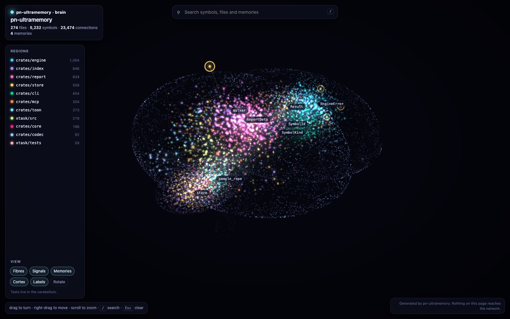
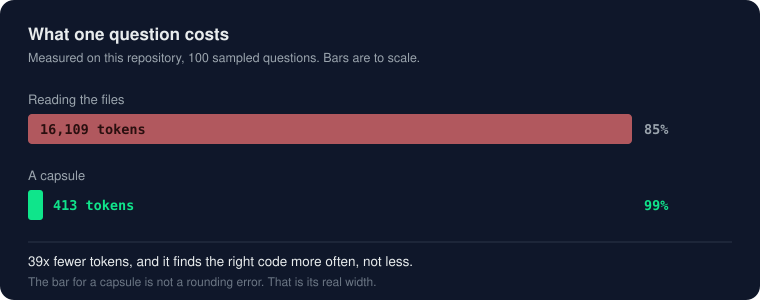
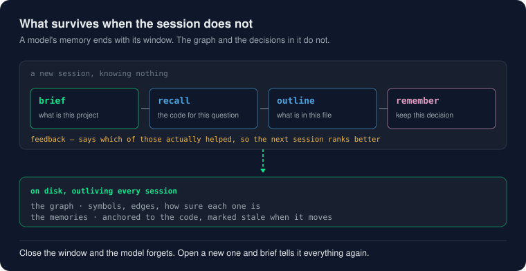
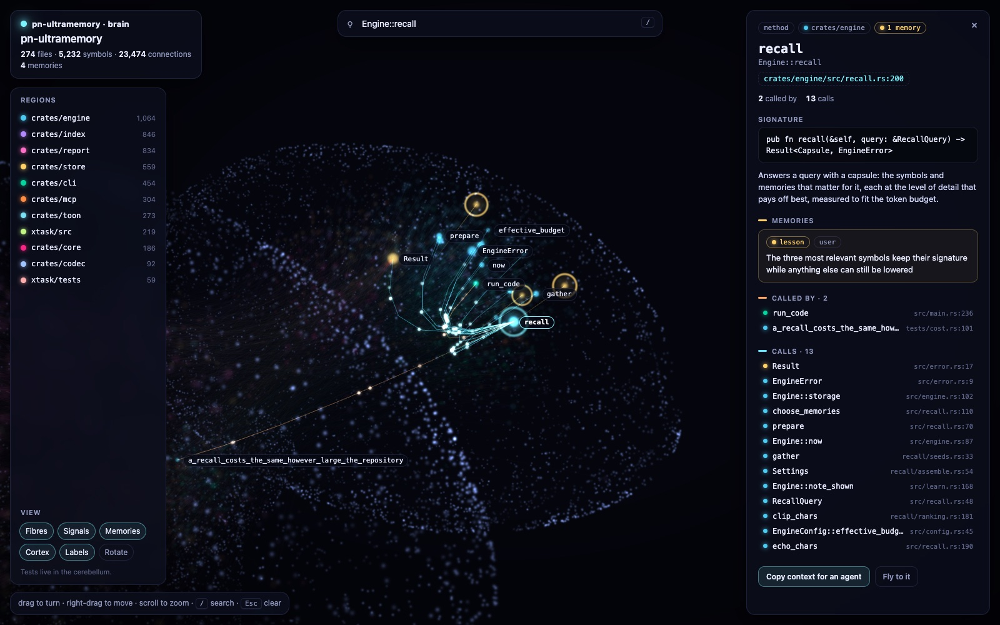
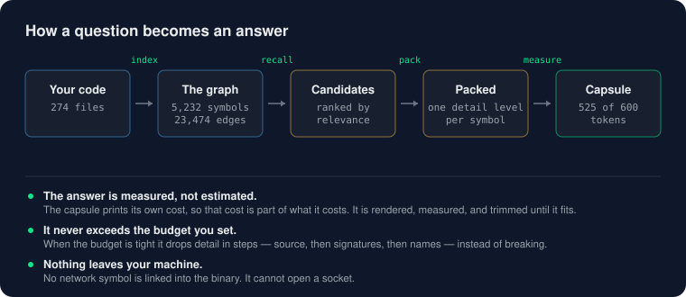
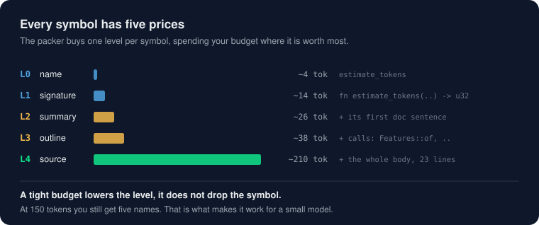
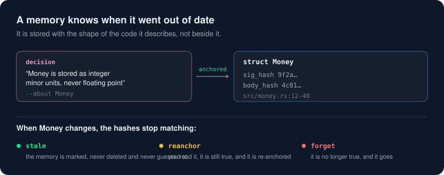

<p align="center">

</p>
<p align="center">
<b>Un segundo cerebro para tu código, compartido por ti y tu agente.</b><br>
Indexa el repositorio en un grafo, responde preguntas en unos cientos de tokens en lugar de archivos
enteros, recuerda decisiones ancladas al código, y te deja volar a través de todo ello en 3D.
</p>
<p align="center">
<a href="README.md">🇬🇧 English</a> ·
<a href="README.es.md">🇪🇸 Español</a>
</p>
<p align="center">
<a href="https://github.com/paulnewmandev/pn-ultramemory/actions/workflows/ci.yml"></a>
<a href="https://github.com/paulnewmandev/pn-ultramemory/actions/workflows/guards.yml"></a>
<a href="LICENSE"></a>


</p>
<p align="center">

</p>
---
## Por qué existe
Un agente de código aprende tu código leyendo archivos enteros. La mayor parte de lo que lee no es la
respuesta, pagas por cada token, y todo lo que aprendió desaparece cuando termina la sesión.
pn-ultramemory conserva ese conocimiento en disco:
- **Un grafo del código.** Cada función, método, clase y tipo, y quién llama y usa a quién, cada
relación marcada con cuánta seguridad tiene el indexador.
- **Respuestas, no archivos.** Una pregunta devuelve una *cápsula*: los símbolos que importan, cada
uno al nivel de detalle que cabe, dentro de un presupuesto de tokens que tú defines.
- **Memorias que no pueden mentir silenciosamente.** Las decisiones y lecciones están ancladas al
código que describen. Cuando ese código cambia, la memoria se marca obsoleta — ahora *con la razón*
(firma cambiada, cuerpo cambiado, o símbolo desaparecido) — en lugar de ser confiada.
- **PageRank para hubs estructurales.** Cada símbolo recibe una importancia base solo por la forma
del grafo, así los cargadores de configuración, tipos de error y asignadores compartidos aparecen
aunque ninguna palabra clave apunte a ellos.
- **Borradores de memoria.** Cuando un agente expande un símbolo poco después de recordarlo, el motor
escribe un borrador en vez de una memoria confirmada, para que la siguiente sesión pueda revisarla y
aceptarla sin repetir lo que ya hizo.
- **Un cerebro que puedes recorrer.** El mismo grafo y las mismas memorias, dibujados en 3D en tu
navegador, para que una persona pueda ver la forma del código y entregar cualquier parte a un agente.
Un binario estático. Nunca abre una conexión de red, no escribe nada dentro de tu repositorio, y no
cuesta nada.
<p align="center">

</p>
---
## Empieza en dos minutos
```bash
# 1. Instalar (macOS y Linux): el binario correcto para esta máquina, verificado contra su SHA-256
curl -fsSL https://raw.githubusercontent.com/paulnewmandev/pn-ultramemory/main/install.sh | sh
# 2. Desde la raíz de tu proyecto, construir el grafo
pn-ultramemory index
# 3. Conectar tu agente, luego reiniciarlo (un servidor MCP solo se lee al arrancar)
pn-ultramemory install --agents claude-code # o cursor, codex, gemini, windsurf, zed, …
# 4. Mirarlo
pn-ultramemory brain
```
El instalador pone el binario en `~/.local/bin` y, si esa carpeta aún no está en tu `PATH`, imprime
la única línea a agregar. No necesita root y no cambia nada más.
- **Windows:** descarga `pn-ultramemory-x86_64-pc-windows-msvc.zip` de la
[última release](https://github.com/paulnewmandev/pn-ultramemory/releases/latest), descomprímelo, y
pon `pn-ultramemory.exe` en tu `PATH`.
- **Cualquier otra cosa** (Linux en ARM, por ejemplo): `cargo build --release` con un toolchain de Rust.
- **Verificar:** `pn-ultramemory doctor` revisa cada paso y nombra el comando que arregla lo que falte.
- **Dejar que un agente lo haga:** apúntalo a [AGENTS.md](AGENTS.md), escrito para que un modelo lo
ejecute paso a paso.
---
## Lo que obtiene tu agente
Nueve herramientas sobre Model Context Protocol. La lista completa cuesta unos mil tokens, leídos una
vez por sesión.
| Herramienta | Responde | En lugar de |
|---|---|---|
| **`brief`** | Qué es este proyecto: tamaño, módulos, símbolos más activos, cada decisión registrada | Leer un README y adivinar |
| `recall` | Qué código importa para esta pregunta, dentro de un presupuesto | Leer varios archivos |
| `outline` | Todo lo que declara un archivo, por una fracción de sus tokens | Leer el archivo entero |
| `expand` | El fuente exacto de un símbolo | Leer alrededor |
| `impact` | Qué depende de esto, y cuán segura es esa respuesta | Buscar el nombre con grep |
| `map` | Qué archivos existen y qué hay en ellos | Listar el árbol |
| `remember` | Guardar esta decisión, anclada al código | Un comentario que nadie lee |
| `memories` | Qué sabemos ya, y qué quedó obsoleto (con razones) | Preguntar de nuevo |
| `feedback` | Esa respuesta ayudó, o no | Nada |
<p align="center">

</p>
Una sesión empieza con `brief`, pregunta con `recall` y un presupuesto, escribe `remember` cuando algo
se decide, y envía `feedback` para que la siguiente sesión ordene mejor. El grafo y las memorias
sobreviven a la sesión; ese es el punto.
El agente también recibe dos pequeños ganchos: una línea al inicio de sesión diciendo que el repositorio
está indexado, y, como máximo una vez por sesión, un aviso para usar `recall` cuando está a punto de
buscar en todo el repositorio o leer un archivo muy grande. Un gancho nunca bloquea nada.
`PN_ULTRAMEMORY_NO_HOOKS=1` los desactiva.
---
## El cerebro
```bash
pn-ultramemory brain # --lang en para inglés
```
<p align="center">

</p>
- **La forma significa algo.** Cada carpeta es una región de la corteza, en pares espejados sobre los
dos hemisferios, las más grandes primero. Los tests viven en el cerebelo. Las fibras corren por debajo
como materia blanca y se desvanecen desde donde parten hasta donde llegan, así la dirección se ve sin
una flecha. Los pulsos viajan del llamador al llamado.
- **Buscar, luego leer.** `/` busca símbolos, rutas, documentación y memorias. Abrir una partícula
muestra su firma, su documentación, qué la llama, a qué llama y cada memoria anclada; cada uno de esos
enlaza a la siguiente partícula, como notas en un cuaderno.
- **Entregarlo a un agente.** *Copiar contexto para un agente* pone el símbolo, su ubicación, sus
llamadores, sus llamados y sus memorias en el portapapeles, con los comandos para ir más allá: unos
cientos de tokens que orientan a un modelo más rápido que cualquier archivo.
- **Sellado.** Un archivo HTML en el directorio de datos, WebGL puro sin librerías. Su
Content-Security-Policy no nombra ninguna fuente para conexiones, imágenes, fuentes o frames, así el
propio navegador rechaza cualquier petición que la página pudiera hacer.
Se abre en tu navegador cuando lo ejecutas en terminal; `--no-open` solo lo escribe, `-o` lo pone en
otro lugar. Repositorios muy grandes conservan sus 6,000 símbolos más dependidos (`--max-nodes`), que
se dibuja suavemente en un portátil. Este repositorio, 4,890 símbolos, se dibuja en un cuarto de segundo.
---
## Cuánto ahorra, medido
`pn-ultramemory bench` muestrea 100 símbolos documentados, convierte cada uno en una pregunta, y compara
la cápsula con lo que hace un agente sin índice: leer los tres archivos que una búsqueda por palabras
clasifica más alto. En este repositorio (274 archivos, 5,232 símbolos):
| Pregunta construida desde | Presupuesto | Encuentra el código | Tokens | Leyendo archivos en su lugar | Ahorro |
|---|---:|---:|---:|---:|---:|
| su documentación | 500 | **100%** | 464 | 16,520 · lo encuentra 84% | **97.2%** |
| su documentación | 1,000 | **100%** | 645 | 16,520 | **96.1%** |
| su documentación | 2,000 | **100%** | 1,366 | 16,520 | **91.7%** |
| su nombre | 500 | **100%** | 446 | 15,438 · lo encuentra 62% | **97.1%** |
| su nombre | 1,000 | **99%** | 672 | 15,438 | **95.7%** |
En una aplicación Laravel de 541 archivos el mismo benchmark da 100% desde documentación con 95% menos
tokens, y 85–93% desde nombres contra 66% leyendo archivos.
**Lee estos números por lo que son.** Las preguntas vienen de la propia documentación de los símbolos,
así que esto mide encontrar algo conocido, no resolver una tarea, y la herramienta lo dice en su salida.
Las preguntas simples funcionan bien cuando usan las propias palabras del código ("validate coupon
discount on order" encuentra `CouponService::validate` primero) y peor cuando no comparten ninguna. Las
preguntas en español sobre código escrito en inglés reciben ayuda de un glosario incorporado de palabras
de programación y negocios: "¿cómo se estima el número de tokens?" encuentra `estimate_tokens`, y
"dividir la cuenta entre clientes" encuentra `BillSplitService`. Palabras fuera del glosario, y otros
idiomas, se buscan tal cual. Mide tu propio repositorio con `pn-ultramemory bench`: el ahorro es lo que
leer archivos enteros habría costado, así que un proyecto pequeño ahorra menos.
| Velocidad, este repositorio, portátil Apple silicon | |
|---|---|
| Índice completo desde cero | **~430 ms** |
| Reindexar tras cambiar un archivo | **~200 ms** |
| Reindexar sin cambios | **12 ms** |
| Un `recall` | **5 ms** mediana, 6.5 ms en el percentil 95 |
---
## Cómo funciona
<p align="center">

</p>
**Un grafo que dice cuán seguro está.** Doce lenguajes se parsean con tree-sitter (Rust, Python,
JavaScript, TypeScript, TSX, Go, Java, C, C++, C#, Ruby, PHP); cualquier otro lenguaje se indexa con un
pase léxico, así nada es invisible. Cada arista lleva una confianza: `Exact`, `Resolved`, `Heuristic` o
`Guess`.
**Las llamadas se leen con su receptor.** Un nombre de método solo es evidencia débil:
`$request->validate()` en un controlador Laravel no es una llamada a tu único `CouponService::validate`,
y `items.is_empty()` no es una llamada a tu único `is_empty`. Una llamada hecha sobre un receptor que no
apunta al candidato, por su tipo, su archivo o su directorio, es solo un `Guess`, lo que la mantiene
fuera de `impact`, `brief` y el cerebro por defecto. El receptor también ayuda: `engine.recall()` resuelve
a `Engine::recall` entre varios métodos `recall`.
**PageRank da a cada símbolo una importancia base.** La coincidencia de texto, la propagación de vecinos
y el coacceso aprendido son todos locales: necesitan una semilla desde la que empezar. Un símbolo al que
todo llama pero nada nombra explícitamente puede ser invisible a una búsqueda por palabras. PageRank se
calcula una vez por índice completo sobre todo el grafo (damping 0.85, hasta 20 iteraciones, convergencia
L1 bajo 1e-6) y se guarda por símbolo, para que el empaquetador pueda ofrecer hubs estructurales aunque
ninguna semilla apunte directamente a ellos.
**Una respuesta es un problema de empaquetamiento.** Cada símbolo se puede mostrar en cinco niveles:
nombre, firma, resumen, esquema de lo que llama, o fuente completo. `recall` elige un nivel por símbolo
para dar el mayor valor dentro del presupuesto (una mochila de opción múltiple, verificada contra un
solver exacto), luego mide la cápsula impresa y la recorta hasta que cabe. Los tres símbolos más
relevantes conservan al menos su firma mientras cualquier otra cosa todavía se puede ceder, y un
presupuesto ajustado baja el detalle en vez de quitar respuestas.
<p align="center">

</p>
**`impact` nunca dice "seguro".** Responde `exact` (el conjunto está completo), `lower-bound` (al menos
estos) o `unknown` (no se encontró llamador y el símbolo es público, lo que no significa que nadie lo use).
**Las memorias siguen una regla.** *La corroboración aumenta la probabilidad de recuperar una memoria,
nunca la de que sea verdad.* Las repeticiones en menos de quince minutos cuentan como una, el texto
capturado de una herramienta nunca corrobora, y ninguna memoria acumula más de ocho. Las contradicciones
se comprueban antes que el parecido, porque negar una frase cambia casi ninguna de sus palabras, y se
informan, nunca se fusionan. El inglés y el español se leen bien.
<p align="center">

</p>
**Los borradores de memoria capturan decisiones observadas.** Cuando un agente expande un símbolo poco
después de recordarlo, el motor escribe un borrador en vez de una memoria confirmada. Los borradores
viven en su propia tabla, caducan si nadie los confirma, y nunca cuentan como corroboraciones hasta que
se aceptan. Son la forma del sistema de decir "noté algo; ¿lo guardo?" en vez de fabricar un hecho
silenciosamente.
**La obsolescencia dice por qué.** Una memoria obsoleta registra si cambió la firma del símbolo, su
cuerpo, o si el símbolo desapareció por completo. `memories --stale` muestra la razón, para que una
decisión de reanclaje pueda distinguir "solo cambió el cuerpo, probablemente seguro" de "la firma se
fue, hay que revisar la decisión".
---
## Comandos
| Comando | Qué hace |
|---|---|
| `index` | Construir o refrescar el grafo. Solo se releen archivos cuyo contenido cambió |
| `brief` · `recall` · `outline` · `expand` · `impact` · `map` | Las seis formas de leer, como arriba |
| `brain` | El repositorio como un cerebro 3D en el navegador |
| `graph` | Exportar el grafo como Mermaid, DOT, SVG o JSON |
| `remember` · `memories` · `reanchor` · `forget` | Escribir, listar, confirmar o borrar memorias |
| `feedback` · `learn status\|why\|reset` | Decir qué ayudó, e inspeccionar qué aprendió |
| `report` | Un reporte HTML, PDF o Markdown, en inglés o español |
| `docs gaps\|apply\|build` | Encontrar código sin documentar, aplicar documentación, construir referencia |
| `stats` · `bench` | Números sobre el índice, y el benchmark anterior en tu repositorio |
| `install` · `uninstall` · `doctor` · `serve` · `mcp-config` | Conectar agentes, exactamente reversible, y verificar la configuración |
| `toon encode\|decode` · `completions` | Conversión de formato y completado de shell |

La salida es TOON por defecto, un formato compacto de tablas que cuesta unos 20% menos tokens que JSON;
`-f json` es para programas y `-f text` para personas. Cada flag está en la
[wiki](https://github.com/paulnewmandev/pn-ultramemory/wiki/Commands) y en `--help`.

`install` funciona con Claude Code, Codex CLI, Cursor, Gemini CLI, Windsurf, Zed, Visual Studio Code,
opencode, Kiro, Trae, Cline, Crush y Amp. Nombra el tuyo con `--agents`; sin él, se configura cada
agente encontrado. Solo escribe su propia entrada, `--dry-run` muestra el cambio primero, y `uninstall`
deja el archivo byte por byte como estaba.
---
## Qué queda dónde
| | |
|---|---|
| Tu código | Leído, nunca enviado a ningún lado. No hay código de red enlazado en el binario, y CI ejecuta toda la suite de tests en un namespace de red sin ruta de salida |
| El índice, memorias y contadores | Tu directorio de datos de usuario, una base de datos por proyecto |
| Tu repositorio | Intacto a menos que lo pidas: `docs apply` escribe la documentación que le das, y `report` escribe al directorio actual a menos que pases `-o` |
| La página del cerebro | En el directorio de datos; su política de seguridad le prohíbe cualquier petición |
---
## Lo que no hará
- **No entiende significado.** Toda comparación es sobre palabras: una paráfrasis que no comparta
palabras con el código o con una memoria no se reconoce.
- **Solo traduce español, y solo su vocabulario de programación.** Un glosario de unas 180 palabras
(*validar*, *pedido*, *factura*, …) agrega las palabras en inglés que usa el código a una pregunta en
español; todo lo demás se busca tal cual, y una palabra pegada dentro de un identificador (`recalculate`)
no se encuentra por una parte de ella.
- **No puede distinguir verdadero de falso.** *Obsoleto* significa que el código cambió, no que la
memoria se volvió incorrecta; una persona decide eso con `reanchor` o `forget`.
- **No sabe si tu agente tuvo éxito.** `bench` reporta el éxito de tarea como inobservable en vez de
inventar un número.
- **Es nuevo.** Un autor, pocos usuarios hasta ahora. Trátalo como algo para probar, mídelo en tu propio
código, y reporta lo que se rompa.
---
## Para contribuidores
```
 cli mcp report puntos de entrada: terminal, agentes, archivos
 \ | /
 engine cada caso de uso
 |
 core solo contratos: sin I/O
 / | \
 store index codec SQLite · tree-sitter · empaquetado de tokens
```
Hexagonal: el core no sabe nada de SQLite, tree-sitter o el sistema de archivos. Nada se mergea a menos
que formatting, `clippy -D warnings`, documentación, 1,368 tests y `cargo deny` pasen en macOS, Linux y
Windows, más cuatro trinquetes que solo pueden encogerse: cabeceras de licencia, mensajes de error que
nombran una solución, sin panics en código de librería, y documentación que dice más que el nombre del
item. Ver [CONTRIBUTING.md](CONTRIBUTING.md), [CONTRIBUTING-WORKFLOW.md](CONTRIBUTING-WORKFLOW.md) y
[AI_POLICY.md](AI_POLICY.md).
| | |
|---|---|
| [Wiki](https://github.com/paulnewmandev/pn-ultramemory/wiki) | Instalación, primera hora, cada comando, el cerebro, herramientas MCP, FAQ, troubleshooting |
| [docs/architecture.md](docs/architecture.md) | Las capas y por qué están separadas |
| [docs/memory.md](docs/memory.md) | Qué se guarda, y cómo se encuentran duplicados y contradicciones |
| [docs/formats.md](docs/formats.md) | TOON, cápsulas y cada forma de salida |
| [docs/benchmark.md](docs/benchmark.md) | Cómo se producen los números anteriores |
| [docs/quality.md](docs/quality.md) | Cada guardia, y qué no prueba cada una |
| [CHANGELOG.md](CHANGELOG.md) | Qué cambió, release por release |
---
Apache-2.0: úsalo, cámbialo, véndelo, haz fork. Ver [LICENSE](LICENSE) y
[TRADEMARKS.md](TRADEMARKS.md). [Código de conducta](CODE_OF_CONDUCT.md) ·