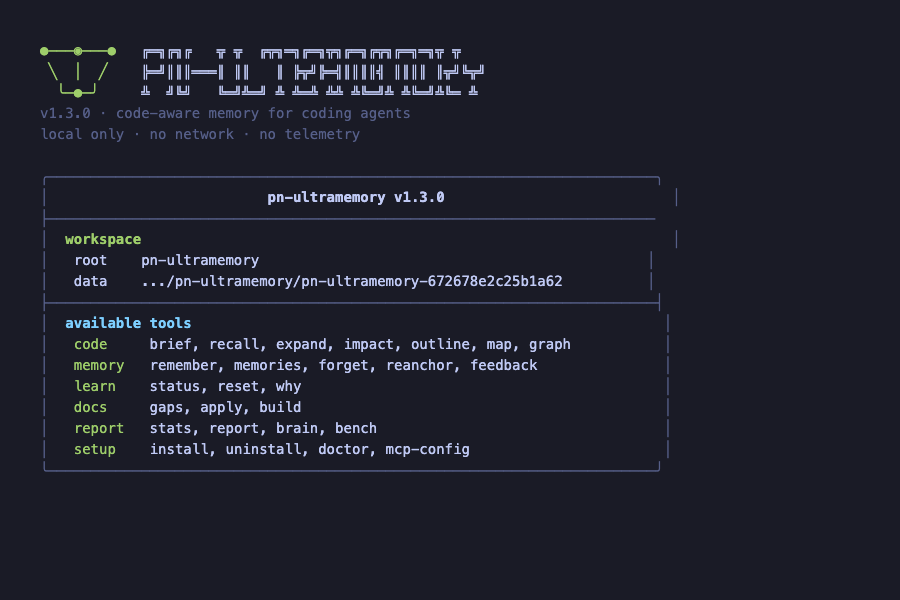
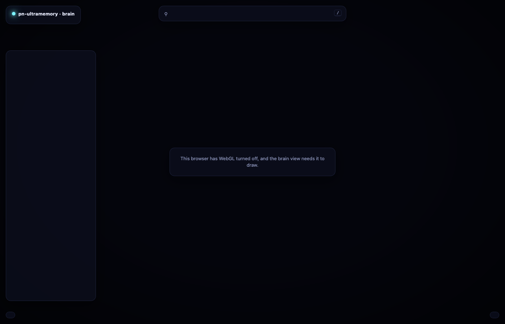

<p align="center">

</p>

<p align="center">
<b>A second brain for your codebase, shared by you and your coding agent.</b><br>
It indexes the repository into a graph, answers questions in a few hundred tokens instead of whole
files, remembers decisions anchored to the code, and lets you fly through all of it in 3D.
</p>

<p align="center">
<a href="README.md">🇬🇧 English</a> ·
<a href="README.es.md">🇪🇸 Español</a>
</p>

<p align="center">
<a href="https://github.com/paulnewmandev/pn-ultramemory/actions/workflows/ci.yml"></a>
<a href="https://github.com/paulnewmandev/pn-ultramemory/actions/workflows/guards.yml"></a>
<a href="LICENSE"></a>


</p>

<p align="center">

</p>

<p align="center">

</p>

---

## Why it exists

A coding agent learns your code by reading whole files. Most of what it reads is not the answer,
you pay for every token, and everything it learned is gone when the session ends.

pn-ultramemory keeps that knowledge on disk instead:

- **A graph of the code.** Every function, method, class and type, and who calls and uses whom,
  each relationship marked with how sure the indexer is.
- **Answers, not files.** A question returns a *capsule*: the symbols that matter, each at the
  level of detail that fits, inside a token budget you set.
- **Memories that cannot silently lie.** Decisions and lessons are anchored to the code they
  describe. When that code changes, the memory is marked stale — now *with the reason* (signature
  changed, body changed, or symbol gone) — instead of being trusted.
- **PageRank for structural hubs.** Every symbol gets a baseline importance from the graph's shape
  alone, so config loaders, error types and shared allocators surface even when no keyword points
  at them.
- **Draft memories.** When an agent expands a symbol shortly after recalling it, the engine writes
  a draft instead of a confirmed memory, so the next session can review and accept it without
  restating what it already did.
- **A brain you can walk through.** The same graph and memories, drawn in 3D in your browser, so a
  person can see the shape of the code and hand any part of it to an agent.

One static binary. It never opens a network connection, writes nothing inside your repository, and
costs nothing.

<p align="center">

</p>

---

## Start in two minutes

```bash
# 1. Install (macOS and Linux): the right binary for this machine, checked against its SHA-256
curl -fsSL https://raw.githubusercontent.com/paulnewmandev/pn-ultramemory/main/install.sh | sh

# 2. From the root of your project, build the graph
pn-ultramemory index

# 3. Connect your agent, then restart it (an MCP server is only read at startup)
pn-ultramemory install --agents claude-code     # or cursor, codex, gemini, windsurf, zed, …

# 4. Look at it
pn-ultramemory brain
```

The installer puts the binary in `~/.local/bin` and, if that folder is not on your `PATH` yet,
prints the one line to add. It needs no root and changes nothing else.

- **Windows:** download `pn-ultramemory-x86_64-pc-windows-msvc.zip` from the
  [latest release](https://github.com/paulnewmandev/pn-ultramemory/releases/latest), unzip it, and
  put `pn-ultramemory.exe` on your `PATH`.
- **Anything else** (Linux on ARM, for example): `cargo build --release` with a Rust toolchain.
- **Check it:** `pn-ultramemory doctor` reviews every step and names the command that fixes
  anything missing.
- **Let an agent do it:** point it at [AGENTS.md](AGENTS.md), written for a model to carry out
  step by step.

---

## What your agent gets

Nine tools over the Model Context Protocol. The whole list costs about a thousand tokens, read once
per session.

| Tool | It answers | Instead of |
|---|---|---|
| **`brief`** | What is this project: size, modules, busiest symbols, every decision on record | Reading a README and guessing |
| `recall` | Which code matters for this question, inside a budget | Reading several files |
| `outline` | Everything one file declares, for a fraction of its tokens | Reading the whole file |
| `expand` | The exact source of one symbol | Reading around it |
| `impact` | What depends on this, and how sure that answer is | Grepping for the name |
| `map` | Which files exist and what is in them | Listing the tree |
| `remember` | Keep this decision, anchored to the code | A comment nobody reads |
| `memories` | What do we already know, and what went stale (with reasons) | Asking again |
| `feedback` | That answer helped, or it did not | Nothing |

<p align="center">

</p>

A session starts with `brief`, asks `recall` with a budget, writes `remember` when something is
decided, and sends `feedback` so the next session ranks better. The graph and the memories survive
the session; that is the whole point.

The agent also gets two small hooks: one line at session start saying the repository is indexed,
and, at most once per session, a nudge to `recall` when it is about to search the whole repository
or read a very large file. A hook never blocks anything. `PN_ULTRAMEMORY_NO_HOOKS=1` turns them off.

---

## The brain

```bash
pn-ultramemory brain              # --lang es for Spanish
```

<p align="center">

</p>

- **The shape means something.** Each folder is a region of the cortex, in mirrored pairs over
  the two hemispheres, the largest first. Tests live in the cerebellum. Fibres run underneath like
  white matter and fade from where they leave to where they arrive, so direction shows without an
  arrowhead. Pulses travel from caller to callee.
- **Search, then read.** `/` searches symbols, paths, documentation and memories. Opening a
  particle shows its signature, its documentation, what calls it, what it calls and every memory
  anchored to it; each of those links to the next particle, the way notes link in a notebook.
- **Hand it to an agent.** *Copy context for an agent* puts the symbol, its location, its callers,
  its callees and its memories on the clipboard, with the commands to go further: a few hundred
  tokens that orient a model faster than any file.
- **Sealed.** One HTML file in the data directory, plain WebGL with no library. Its
  Content-Security-Policy names no source for connections, images, fonts or frames, so the browser
  itself refuses any request the page could make.

It opens in your browser when you run it at a terminal; `--no-open` only writes it, `-o` puts it
elsewhere. Very large repositories keep their 6,000 most depended-on symbols (`--max-nodes`), which
draws smoothly on a laptop. This repository, 4,890 symbols, is drawn in a quarter of a second.

---

## What it saves, measured

`pn-ultramemory bench` samples 100 documented symbols, turns each into a question, and compares the
capsule with what an agent without an index does: read the three files a keyword search ranks
highest. On this repository (274 files, 5,232 symbols):

| Question built from | Budget | Finds the code | Tokens | Reading files instead | Saved |
|---|---:|---:|---:|---:|---:|
| its documentation | 500 | **100%** | 464 | 16,520 · finds it 84% | **97.2%** |
| its documentation | 1,000 | **100%** | 645 | 16,520 | **96.1%** |
| its documentation | 2,000 | **100%** | 1,366 | 16,520 | **91.7%** |
| its name | 500 | **100%** | 446 | 15,438 · finds it 62% | **97.1%** |
| its name | 1,000 | **99%** | 672 | 15,438 | **95.7%** |

On a 541-file Laravel application the same benchmark gives 100% from documentation at 95% fewer
tokens, and 85–93% from names against 66% for reading files.

**Read these numbers for what they are.** The questions come from the symbols' own documentation,
so this measures finding a known thing, not solving a task, and the tool says so in its output.
Plain questions do well when they use the code's own words ("validate coupon discount on order"
finds `CouponService::validate` first) and worse when they share none. Spanish questions about code
written in English get help from a built-in glossary of programming and business words:
"¿cómo se estima el número de tokens?" finds `estimate_tokens`, and "dividir la cuenta entre
clientes" finds `BillSplitService`. Words outside the glossary, and other languages, are searched as
written. Measure your own repository with `pn-ultramemory bench`: the saving is what reading whole
files would have cost, so a small project saves less.

| Speed, this repository, Apple silicon laptop | |
|---|---|
| Full index from nothing | **~430 ms** |
| Re-index after changing one file | **~200 ms** |
| Re-index with nothing changed | **12 ms** |
| One `recall` | **5 ms** median, 6.5 ms at the 95th percentile |

---

## How it works

<p align="center">

</p>

**A graph that says how sure it is.** Twelve languages are parsed with tree-sitter (Rust, Python,
JavaScript, TypeScript, TSX, Go, Java, C, C++, C#, Ruby, PHP); every other language is indexed by a
lexical pass, so nothing is invisible. Every edge carries a confidence: `Exact`, `Resolved`,
`Heuristic` or `Guess`.

**Calls are read with their receiver.** A method name alone is weak evidence: `$request->validate()`
in a Laravel controller is not a call to your one `CouponService::validate`, and `items.is_empty()`
is not a call to your one `is_empty`. A call made on a receiver that does not point at the candidate,
by its type, its file or its directory, is only a `Guess`, which keeps it out of `impact`, `brief`
and the brain by default. The receiver also helps: `engine.recall()` resolves to `Engine::recall`
among several `recall` methods.

**PageRank gives every symbol a baseline importance.** Text match, neighbor propagation and learned
co-access are all local: they need a seed to start from. A symbol that everything calls but nothing
names explicitly can be invisible to keyword search. PageRank is computed once per full index over
the whole graph (damping 0.85, up to 20 iterations, L1 convergence below 1e-6) and stored per
symbol, so the packer can offer structural hubs even when no seed points at them directly.

**An answer is a packing problem.** Every symbol can be shown at five levels: name, signature,
summary, outline of what it calls, or full source. `recall` picks one level per symbol to give the
most value inside the budget (a multiple-choice knapsack, checked against an exact solver), then
measures the printed capsule and trims it until it fits. The three most relevant symbols keep at
least their signature while anything else can still be given up, and a tight budget lowers detail
instead of dropping answers.

<p align="center">

</p>

**`impact` never says "safe".** It answers `exact` (the set is complete), `lower-bound` (at least
these) or `unknown` (no caller found and the symbol is public, which does not mean nobody uses it).

**Memories follow one rule.** *Corroboration raises how likely a memory is to be retrieved, never
how likely it is to be true.* Repetitions within fifteen minutes count once, text captured from a
tool never corroborates, and no memory gathers more than eight. Contradictions are checked before
similarity, because negating a sentence changes almost none of its words, and they are reported,
never merged. English and Spanish are both read properly.

<p align="center">

</p>

**Draft memories capture observed decisions.** When an agent expands a symbol shortly after recalling
it, the engine writes a draft instead of a confirmed memory. Drafts live in their own table, expire
if nobody confirms them, and never count as corroborations until accepted. They are the system's way
of saying "I noticed something; should I keep it?" rather than silently manufacturing a fact.

**Staleness says why.** A stale memory records whether the symbol's signature changed, its body
changed, or the symbol disappeared entirely. `memories --stale` shows the reason, so a reanchor
decision can distinguish "body-only edit, probably safe" from "signature gone, revisit the decision".

---

## Commands

| Command | What it does |
|---|---|
| `index` | Build or refresh the graph. Only files whose content changed are read again |
| `brief` · `recall` · `outline` · `expand` · `impact` · `map` | The six ways of reading, as above |
| `brain` | The repository as a 3D brain in the browser |
| `graph` | Export the graph as Mermaid, DOT, SVG or JSON |
| `remember` · `memories` · `reanchor` · `forget` | Write, list, confirm or drop memories |
| `feedback` · `learn status\|why\|reset` | Tell it what helped, and inspect what it learned |
| `report` | An HTML, PDF or Markdown report, in English or Spanish |
| `docs gaps\|apply\|build` | Find undocumented code, apply documentation, build a reference |
| `stats` · `bench` | Numbers about the index, and the benchmark above on your repository |
| `install` · `uninstall` · `doctor` · `serve` · `mcp-config` | Connect agents, exactly reversibly, and check the setup |
| `toon encode\|decode` · `completions` | Format conversion and shell completions |

Output is TOON by default, a compact table format that costs about 20% fewer tokens than JSON;
`-f json` is for programs and `-f text` for people. Every flag is in the
[wiki](https://github.com/paulnewmandev/pn-ultramemory/wiki/Commands) and in `--help`.

`install` works with Claude Code, Codex CLI, Cursor, Gemini CLI, Windsurf, Zed, Visual Studio Code,
opencode, Kiro, Trae, Cline, Crush and Amp. Name yours with `--agents`; without it, every agent found
is configured. It writes only its own entry, `--dry-run` shows the change first, and `uninstall`
leaves the file byte for byte as it was.

---

## What stays where

| | |
|---|---|
| Your code | Read, never sent anywhere. No network code is linked into the binary, and CI runs the whole test suite in a network namespace with no route out |
| The index, memories and counters | Your user data directory, one database per project |
| Your repository | Untouched unless you ask: `docs apply` writes the documentation you give it, and `report` writes to the current directory unless you pass `-o` |
| The brain page | In the data directory; its security policy forbids it any request |

---

## What it will not do

- **It does not understand meaning.** Every comparison is over words: a paraphrase that shares no
  words with the code or with a memory is not recognised.
- **It translates only Spanish, and only its programming vocabulary.** A glossary of about 180
  words (*validar*, *pedido*, *factura*, …) adds the English words code uses to a Spanish question;
  everything else is searched as written, and a word glued inside an identifier (`recalculate`) is
  not found by a part of it.
- **It cannot tell true from false.** *Stale* means the code changed, not that the memory became
  wrong; a person decides that with `reanchor` or `forget`.
- **It does not know whether your agent succeeded.** `bench` reports task success as unobservable
  rather than inventing a number.
- **It is new.** One author, few users so far. Treat it as something to try, measure it on your own
  code, and report what breaks.

---

## For contributors

```
           cli      mcp      report          entry points: terminal, agents, files
              \      |      /
                  engine                     every use case
                    |
                   core                      contracts only: no I/O
              /     |      \
          store   index   codec              SQLite · tree-sitter · token packing
```

Hexagonal: the core knows nothing about SQLite, tree-sitter or the file system. Nothing merges
unless formatting, `clippy -D warnings`, documentation, 1,368 tests and `cargo deny` pass on macOS,
Linux and Windows, plus four ratchets that may only shrink: licence headers, error messages that
name a way forward, no panics in library code, and documentation that says more than the item's
name. See [CONTRIBUTING.md](CONTRIBUTING.md), [CONTRIBUTING-WORKFLOW.md](CONTRIBUTING-WORKFLOW.md)
and [AI_POLICY.md](AI_POLICY.md).

| | |
|---|---|
| [Wiki](https://github.com/paulnewmandev/pn-ultramemory/wiki) | Install, first hour, every command, the brain, MCP tools, FAQ, troubleshooting |
| [docs/architecture.md](docs/architecture.md) | The layers and why they are separate |
| [docs/memory.md](docs/memory.md) | What is stored, and how duplicates and contradictions are found |
| [docs/formats.md](docs/formats.md) | TOON, capsules and every output shape |
| [docs/benchmark.md](docs/benchmark.md) | How the numbers above are produced |
| [docs/quality.md](docs/quality.md) | Every guard, and what each does not prove |
| [CHANGELOG.md](CHANGELOG.md) | What changed, release by release |

---

Apache-2.0: use it, change it, sell it, fork it. See [LICENSE](LICENSE) and
[TRADEMARKS.md](TRADEMARKS.md). [Code of conduct](CODE_OF_CONDUCT.md) ·