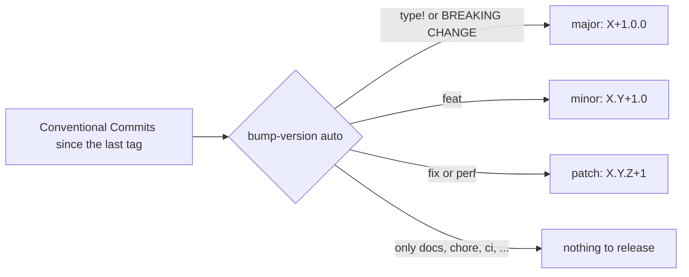

# Versioning and releasing

The whole workspace shares **one version**, written once in the root `Cargo.toml`. Every crate
inherits it (`version.workspace = true`). The project follows
[Semantic Versioning 2.0.0](https://semver.org/) and keeps a
[Keep a Changelog](https://keepachangelog.com/en/1.1.0/) changelog. The current version is the one
declared in `[workspace.package]` of the root `Cargo.toml`. Examples below start from `1.2.36`.

**Contents**

1. [What counts as the public API](#what-counts-as-the-public-api)
2. [Which number to bump](#which-number-to-bump)
3. [The bump script](#the-bump-script)
4. [Release checklist](#release-checklist)
5. [How the version is checked](#how-the-version-is-checked)

## What counts as the public API

Semantic Versioning only means something once you say what the public API is. For pn-ultramemory
it is everything a user or a script can depend on.

| Surface | Breaking means, for example |
|---|---|
| **Command line** | Removing or renaming a command or flag, changing an exit code, changing output that is documented as machine-readable |
| **MCP tools** | Removing a tool, or renaming or removing a parameter, changing the meaning of a result field |
| **On-disk data** | A stored-data format change that older data cannot be migrated to automatically |
| **Configuration** | Removing or renaming a setting or environment variable |
| **Language pack format** | A change that makes existing packs stop working |
| **Rust crates** (`pn-ultramemory-core`, `pn-ultramemory-codec`, ...) | Anything the Rust semver rules call breaking, such as removing a public item or changing a signature |

Not part of the public API: private items, human-readable wording of messages, log output,
performance numbers, and the exact ranking of results unless a document promises it.

## Which number to bump

Given a version `X.Y.Z`:

| Change | Bump | Example from 1.2.36 | Resets |
|---|---|---|---|
| Incompatible change to the public API | **major** (`X`) | 2.0.0 | minor and patch go to 0 |
| New functionality, backward compatible | **minor** (`Y`) | 1.3.0 | patch goes to 0 |
| Bug fix, backward compatible | **patch** (`Z`) | 1.2.37 | nothing |

When a release contains several kinds of change, the **highest** one wins, and it resets everything
to its right. A release with one fix and one incompatible change is a major release, and all three
numbers change.



Commit types map to bumps like this:

| Commit | Bump |
|---|---|
| `feat!: ...`, `fix(scope)!: ...`, or a `BREAKING CHANGE:` footer | major |
| `feat: ...` | minor |
| `fix: ...`, `perf: ...` | patch |
| `docs:`, `test:`, `refactor:`, `build:`, `ci:`, `chore:`, `style:` | no release on their own |

## The bump script

[`scripts/bump-version`](../scripts/bump-version) applies a bump and keeps every place that carries
the version in sync. It needs only a POSIX shell, `awk` and `git`. It updates the workspace version
in `Cargo.toml`, the internal dependency versions there, `Cargo.lock`, and it moves the entries
under `## [Unreleased]` in `CHANGELOG.md` beneath a new dated heading, updating the comparison
links. It never pushes anything.

```sh
# Choose the bump yourself
scripts/bump-version patch          # 1.2.36 -> 1.2.37
scripts/bump-version minor          # 1.2.36 -> 1.3.0
scripts/bump-version major          # 1.2.36 -> 2.0.0

# Or let the commit history decide
scripts/bump-version auto

# Preview without changing anything
scripts/bump-version auto --dry-run

# Release: bump, commit as "chore(release): vX.Y.Z", and tag vX.Y.Z
scripts/bump-version auto --commit --tag

# Verify that everything agrees (used by CI)
scripts/bump-version --check
```

| Option | Effect |
|---|---|
| `--dry-run` | Prints the planned change as a diff and modifies nothing |
| `--commit` | Commits `Cargo.toml`, `Cargo.lock` and `CHANGELOG.md`, using the repository's own git identity, with no extra trailers |
| `--tag` | Also creates the annotated tag `vX.Y.Z` (requires `--commit`) |
| `--allow-dirty` | Allows `--commit` when other files have uncommitted changes |
| `--allow-empty` | Allows a release whose `[Unreleased]` section has no entries |
| `--check` | Verifies consistency and exits 1 on any mismatch |

Exit codes: `0` success, `1` inconsistent state or failed check, `2` usage error, `3` nothing
releasable was found in `auto` mode.

The script refuses to release when `[Unreleased]` in the changelog has no entries, and refuses to
commit on a dirty working tree, so a release always describes what changed.

## Release checklist

1. Make sure `main` is green in CI and your working tree is clean.
2. Check that `## [Unreleased]` in `CHANGELOG.md` describes every user-visible change, grouped under
   *Added*, *Changed*, *Deprecated*, *Removed*, *Fixed* and *Security*.
3. Preview: `scripts/bump-version auto --dry-run`, and confirm the bump is the one you expect.
4. Release: `scripts/bump-version auto --commit --tag`.
5. Publish: `git push && git push --tags`.
6. Create the release notes from the changelog section of the new version.

## How the version is checked

`scripts/bump-version --check` runs in CI and fails when:

- the workspace version is not a plain `X.Y.Z`;
- a crate does not inherit the workspace version;
- an internal dependency version differs from the workspace version;
- `Cargo.lock` still has an older version of a workspace crate;
- `CHANGELOG.md` has no section for the current version.
